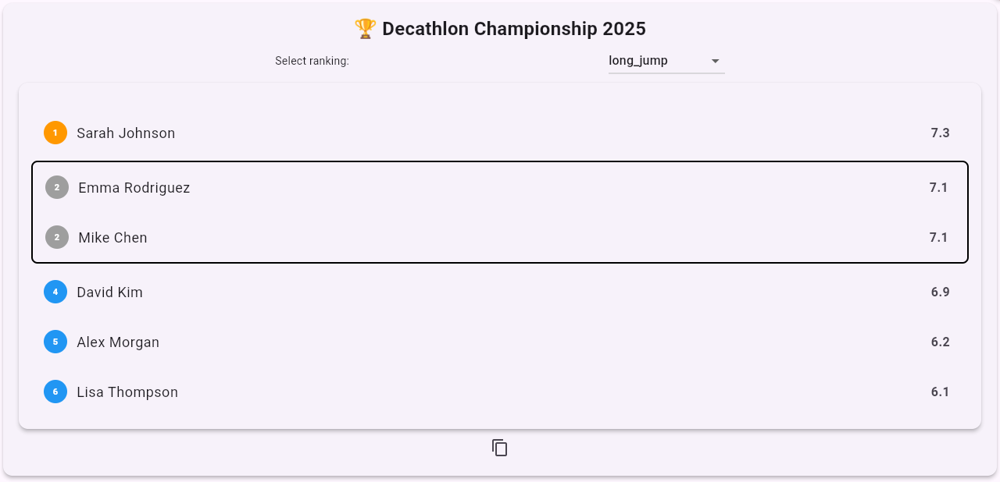

# Ranking System

A flexible and powerful ranking system for Flutter applications that supports multi-metric calculations, automatic tie
handling, category grouping, and rich UI components.

[](https://pub.dev/packages/ranking_system)

## Features

- **Multi-Metric Rankings** - Rank entries across multiple categories simultaneously
- **Automatic Tie Handling** - Smart tie resolution with proper place calculations
- **Category Grouping** - Combine related categories for complex ranking calculations
- **Weighted Scoring** - Assign different weights to categories for customized rankings
- **Flexible Metrics** - Support for any `Comparable` type (numbers, dates, custom objects)
- **Rich UI Components** - Beautiful, interactive leaderboard widget included
- **Ascending/Descending** - Configure sort direction per metric
- **Detailed Analytics** - Verbose ranking breakdowns and statistics

## UI Example
This is a screenshot from the `examples/lib/main.dart` example.

<p align="center">
  
</p>

## Quick Start

### 1. Basic Ranking

```dart
import 'package:ranking_system/ranking_system.dart';

// Create entries with multiple metrics
final entries = [
  RankingEntry(
      name: "Alice",
      metrics: {"score": 95, "time": 120}
  ),
  RankingEntry(
      name: "Bob",
      metrics: {"score": 87, "time": 105}
  ),
  RankingEntry(
      name: "Charlie",
      metrics: {"score": 95, "time": 130}
  ),
];

// Calculate ranking
final ranking = Ranking.calculate(
  entries: entries,
  isAscendingMetric: (metric) => metric == "time", // Lower time is better
);

// Get leaderboard
final leaderboard = ranking.getLeaderboardRanking();
for (final (place, entry, score) in leaderboard) {
print("${place}. ${entry.name} - Score: $score");
}
```

### 2. Category Grouping

```dart
// Group related categories
final groups = [
  RankingGroup(
    name: "Performance",
    groupFunction: (categories) => {"speed", "accuracy"},
  ),
  RankingGroup(
    name: "Quality",
    groupFunction: (categories) => {"design", "usability"},
  ),
];

final ranking = Ranking.calculate(
  entries: entries,
  groups: groups,
);
```

### 3. Weighted Scoring

```dart
// Apply different weights to categories
final ranking = Ranking.calculate(
  entries: entries,
  weights: {
    "score": 8, // 1.8x multiplier
    "time": 5, // 1.5x multiplier  
    "bonus": 0, // 1.0x multiplier (default)
  },
);
```

### 4. UI Integration

```dart
import 'package:ranking_system/ranking_system.dart';

class MyLeaderboard extends StatelessWidget {
  @override
  Widget build(BuildContext context) {
    return Scaffold(
      appBar: AppBar(title: Text('Competition Results')),
      body: LeaderboardView(
        ranking: ranking,
        title: Text('Championship Leaderboard'),
        includeCategoryRanking: true,
        isReversedRanking: false,
        // Higher scores are better
        additionalInformation: Text('Season 2024 Results'),
      ),
    );
  }
}
```

## Advanced Usage

### Custom Comparable Metrics

The system supports any `Comparable` type, including custom classes:

```dart
class UncertainValue implements Comparable<UncertainValue> {
  final double value;
  final double uncertainty;

  UncertainValue(this.value, this.uncertainty);

  @override
  int compareTo(UncertainValue other) {
    return value.compareTo(other.value);
  }
}

final entries = [
  RankingEntry(
      name: "Measurement A",
      metrics: {
        "result": UncertainValue(9.5, 0.2),
        "confidence": 0.95,
      }
  ),
];
```

### Dynamic Weight Updates

```dart
// Start with initial weights
var ranking = Ranking.calculate(entries: entries, weights: {"score": 5});

// Update weights dynamically
ranking = ranking.updateWeights({"score": 8, "time": 3});
```

### Detailed Analytics

```dart
// Get verbose information for any entry
final details = ranking.verboseRankingByEntry("Alice");

print(details);
/*
Output:
Alice:
Global Position: 1. Place

Categories: 
score: Score: 1 (Metric: 95)
time: Score: 2 (Metric: 120)

Number of competitors: 3
Number of categories: 2  
Total score: 2.3
*/
```

## API Reference

### Core Classes

#### `RankingEntry`

Represents a participant in the ranking system.

```text
RankingEntry({
required String name,
required Map<String, Comparable> metrics,
})
```

#### `RankingGroup`

Groups categories for combined calculations for related categories (optional). Can also be nested, to create groups
from groups.

```text
RankingGroup(
{required String name, 
required Set<String> Function(Set<String>) groupFunction, // Input: Current categories/groups, Output: Categories to group (i.e. average over category result)
})
```

#### `Ranking`

Main ranking calculation engine.

```text
Ranking.calculate({
required List<RankingEntry> entries,
List<RankingGroup>? groups,
Map<String, int>? weights,
bool Function(String)? isAscendingMetric,
})
```

### UI Components

#### `LeaderboardView`

Interactive leaderboard widget with rich features.

```text
LeaderboardView({
required Ranking ranking,
bool includeCategoryRanking = false,
bool isReversedRanking = false,
Widget? title,
Widget? additionalInformation,
})
```

## Contributing

Contributions are always welcome! Please feel free to submit a pull request
at [GitHub](https://github.com/biocentral/ranking_system/pulls).

## Support

If you find this package helpful, please consider giving it a ⭐
on [GitHub](https://github.com/biocentral/ranking_system)!

For issues and feature requests, please use the [GitHub Issues](https://github.com/biocentral/ranking_system/issues)
page.
